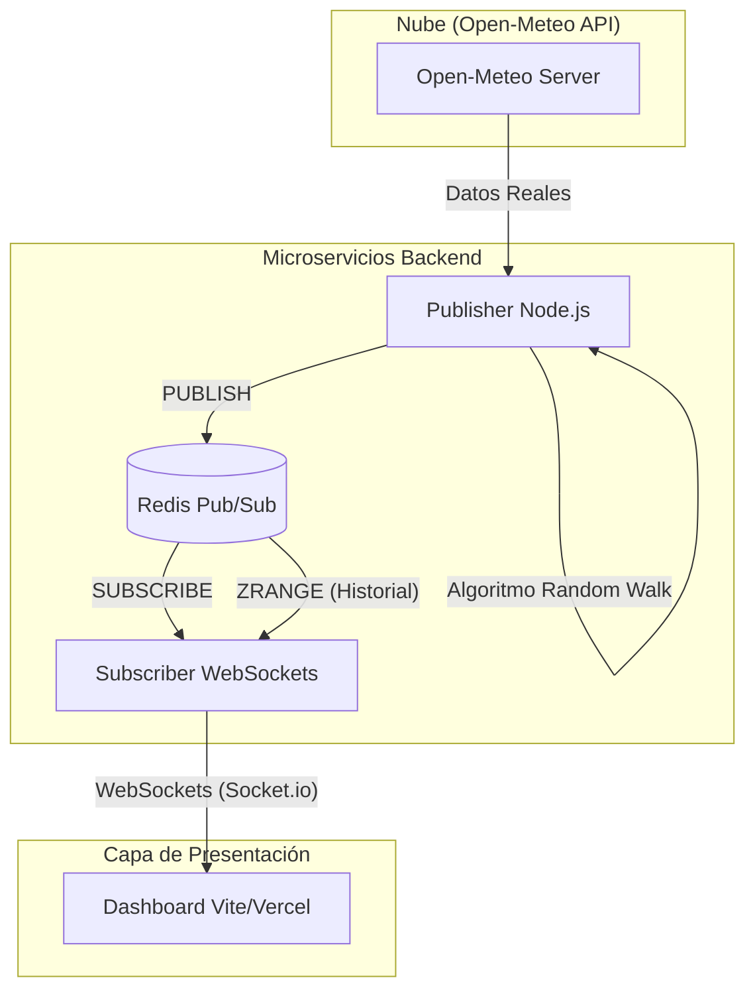
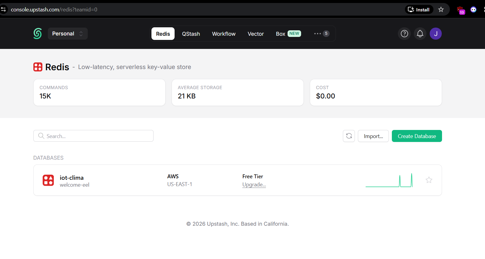

# 🌍 IoT ClimaStream: Red de Monitoreo en Tiempo Real

[](https://iot-clima.vercel.app)
[](https://upstash.com/)
[](https://nodejs.org/)

### 🚀 [Ver Demo en Vivo (Dashboard)](https://iot-clima.vercel.app)

---

## 📋 Descripción del Proyecto

Este ecosistema IoT simula una red avanzada de biosensores climatológicos desplegados en las 8 ciudades principales de Colombia. El sistema utiliza una arquitectura orientada a eventos impulsada por **Redis Pub/Sub**, permitiendo la transmisión de telemetría (temperatura, humedad, presión) con latencia mínima y visualización analítica de alta fidelidad.


*Vista previa del dashboard con Heatmap térmico y telemetría en tiempo real.*

---

## 🏗️ Arquitectura del Sistema

El flujo de datos sigue un modelo de microservicios desacoplados:



---

## 🛠️ Stack Tecnológico

| Componente            | Tecnología       | Rol                                             |
| :-------------------- | :---------------- | :---------------------------------------------- |
| **Frontend**    | React / Vite      | UI Analítica & Rendering 60FPS                 |
| **Mapas**       | Leaflet.js        | Heatmap térmico y geolocalización             |
| **Gráficas**   | Chart.js          | Telemetría dinámica y series temporales       |
| **Backend**     | Node.js / Express | Gestión de flujos y WebSockets                 |
| **Mensajería** | Redis (UPSTASH)   | Broker de eventos Pub/Sub y Caché de historial |
| **Estilos**     | CSS Moderno       | Glassmorphism & Mesh Gradients                  |

---

## ☁️ Despliegue en Producción (Cloud Serverless)

El sistema está optimizado para ejecutarse en infraestructuras gratuitas de alta escalabilidad:

* **🌐 Frontend (Dashboard)**: [https://iot-clima.vercel.app](https://iot-clima.vercel.app) (Vercel)
* **📡 Subscriber (WebSocket API)**: [https://iot-clima-subscriber.onrender.com](https://iot-clima-subscriber.onrender.com) (Render)
* **🤖 Publisher (Worker IoT)**: [https://iot-clima-publisher.onrender.com](https://iot-clima-publisher.onrender.com) (Render)
* **🗄️ Base de Datos**: Instancia de **Redis Serverless** en Upstash.

  

> [!IMPORTANT]
> **Nota sobre el "Cold Start":** Debido a que Render suspende los servicios gratuitos tras 15 minutos de inactividad, la primera carga del dashboard puede tardar entre 60 y 90 segundos en "despertar" al ecosistema de nodos backend.

---

## 💻 Configuración Local

Si deseas ejecutar el proyecto en tu máquina local para pruebas de desarrollo:

### Requisitos

* Docker Desktop
* Node.js v18+

### Paso a Paso (Modo Automático)

Simplemente ejecuta el script de automatización:

```bash
./run_all.bat
```

### Paso a Paso (Modo Manual)

1. **Infraestructura**: `docker-compose up -d`
2. **Subscriber**: `cd subscriber && npm install && npm start`
3. **Publisher**: `cd publisher && npm install && npm start`
4. **Frontend**: `cd frontend && npm install && npm run dev`

---

**Desarrollado para la asignatura de Electiva I**
*Implementación de arquitecturas reactivas y sistemas distribuidos.*
